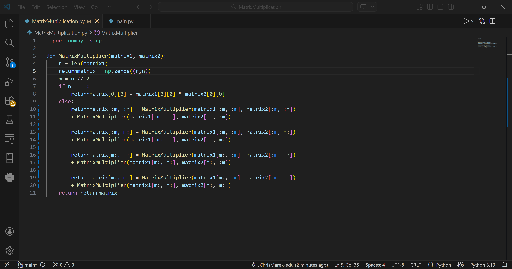
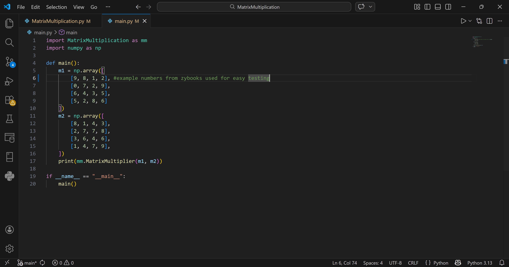
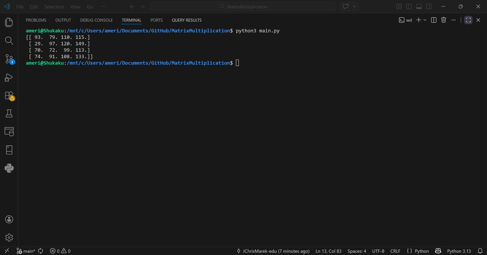

# Matrix Multiplication
An implementation of an algorithm to recursively calculate the multiplication of two $n x n$ matrices. Where the value of $n$ is the number of rows and columns of the two matrices. The value of $n$ also must be a multiple of 2. Traditionally the multiplication of two $n x n$ matrices has a time complexity of $O(n^3)$. Using a Divide and Conquer algorithm such as the one implemented here the time complexity is reduced down to $O(n^{log7})$.

